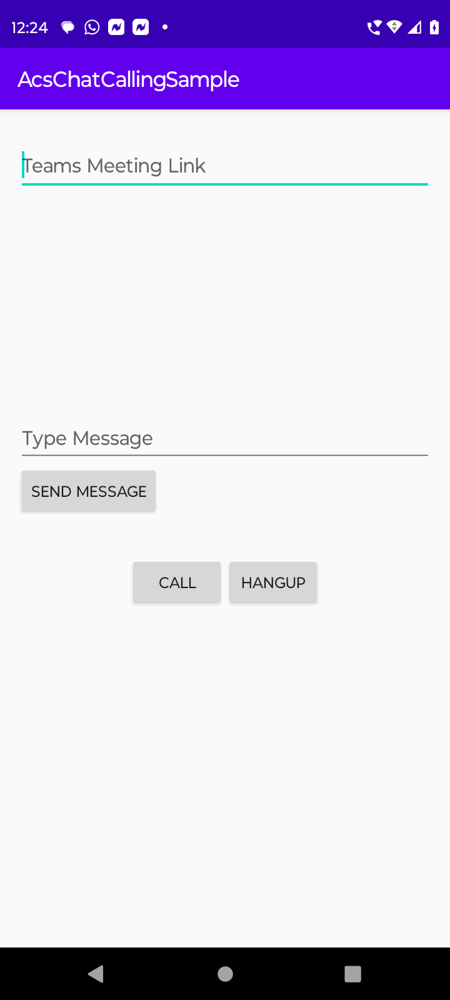

# Quickstart: Add voice and chat calling to your Android app

For full instructions on how to build this code sample from scratch, look at [Quickstart: Add voice calling to your Android app](https://docs.microsoft.com/azure/communication-services/quickstarts/voice-video-calling/getting-started-with-calling?pivots=platform-android)

## Prerequisites

To complete this tutorial, you’ll need the following prerequisites:

- An Azure account with an active subscription. [Create an account for free](https://azure.microsoft.com/free/?WT.mc_id=A261C142F). 
- [Android Studio](https://developer.android.com/studio), for running your Android application.
- A deployed Communication Services resource. [Create a Communication Services resource](https://docs.microsoft.com/azure/communication-services/quickstarts/create-communication-resource).
- A [User Access Token](https://docs.microsoft.com/azure/communication-services/quickstarts/access-tokens) for your Azure Communication Service. Ensure that the token has both VOIP and Chat scopes enabled.

## Code Structure

- **./app/src/main/java/com/microsoft/acscallingchatsample/MainActivity.java:** Contains core logic for Calling and Chat SDK integration.
- **./app/src/main/res/layout/activity_main.xml:** Contains core UI for sample app.

## Object model

The following classes and interfaces used in the quickstart handle some of the major features of the Azure Communication Services Calling client library:

| Name                                  | Description                                                  |
| ------------------------------------- | ------------------------------------------------------------ |
| CallClient| The CallClient is the main entry point to the Calling client library.|
| CallAgent | The CallAgent is used to start and manage calls. |
| CommunicationTokenCredential  | The CommunicationTokenCredential  is used as the token credential to instantiate the CallAgent.|
| ChatClient| ChatClient is the primary interface for developers using this client library. It provides asynchronous methods to create and delete a thread.|
| ChatThreadClient | ChatThreadClient provides asynchronous methods to do the message and chat participants operations within the chat thread.|

## Before running sample code

1. Open an instance of PowerShell, Windows Terminal, Command Prompt or equivalent and navigate to the directory that you'd like to clone the sample to.
2. `git clone https://github.com/Azure-Samples/Communication-Services-Android-Quickstarts.git` 
3. With the `Access Token` procured in pre-requisites, add it to the **./app/src/main/java/com/microsoft/acscallingchatsample/MainActivity.java** file. Assign your access token in line 58:
   ```private static final String UserToken = "<ACS_ACCESS_TOKEN>";```

## Run the sample

Open the sample project using Android Studio and run the application.



Enter a valid teams meeting link in the the `Teams Meeting Link` text box and press the `Call` button , once the call is connected then `ChatClient` and `ChatThreadClient` will be created and it will be possible to send messages and receive messages. All the messages wil appear in the scroll box in the center of the application.
