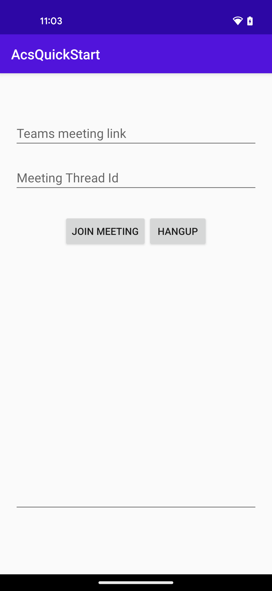

# Quickstart: Join your chat app to a Teams meeting

For full instructions on how to build this code sample from scratch, look at [Quickstart: Join your chat app to a Teams meeting](https://learn.microsoft.com/en-us/azure/communication-services/quickstarts/chat/meeting-interop?pivots=platform-android)

## Prerequisites

To complete this tutorial, you’ll need the following prerequisites:

- An Azure account with an active subscription. [Create an account for free](https://azure.microsoft.com/free/?WT.mc_id=A261C142F).
- [Android Studio](https://developer.android.com/studio), for running your Android application.
- A deployed Communication Services resource. [Create a Communication Services resource](https://docs.microsoft.com/azure/communication-services/quickstarts/create-communication-resource).
- A [User Access Token](https://docs.microsoft.com/azure/communication-services/quickstarts/access-tokens) for your Azure Communication Service.
- A Teams deployment.

## Code Structure

- **./app/src/main/java/com/contoso/acsquickstart/MainActivity.java:** Contains core logic for calling SDK integration.
- **./app/src/main/res/layout/activity_main.xml:** Contains core UI for sample app.

## Object model

The following classes and interfaces used in the quickstart handle some of the major features of the Azure Communication Services Calling client library:

| Name                                  | Description                                                  |
| ------------------------------------- | ------------------------------------------------------------ |
| CallClient | The CallClient is the main entry point to the Calling client library. |
| CallAgent  | The CallAgent is used to start and manage calls. |
| ChatThreadAsyncClient | The ChatThreadAsyncClient is the main entry point to the Chat client library. |
| CommunicationTokenCredential  | The CommunicationTokenCredential  is used as the token credential to instantiate the CallAgent.|

## Before running sample code

1. Open an instance of PowerShell, Windows Terminal, Command Prompt or equivalent and navigate to the directory that you'd like to clone the sample to.
1. `git clone https://github.com/Azure-Samples/Communication-Services-Android-Quickstarts.git`
1. With the `User Token` procured in pre-requisites, add it to the **./app/src/main/java/com/contoso/acsquickstart/MainActivity.java** file. Assign your access token in line 51:
   ```private static final String UserToken = "<User_Access_Token>";```
1. Add the created user ID in line 54:
   ```private static final String InitiatorId = "<USER_ID>";```
1. Add the communications service endpoint URL at line 55:
   ```private static final String ResourceUrl = "<COMMUNICATION_SERVICES_RESOURCE_ENDPOINT>";```

## Run the sample

Open the sample project using Android Studio and run the application.



Insert the Teams meeting URL into the text box, the chat thread ID into the **Meeting Thread Id** text box, and press **Join Meeting** to join the Teams meeting from within your Communication Services application.

## Get the Teams meeting link

The Teams meeting link can be retrieved using Graph APIs. This is detailed in [Graph documentation](https://docs.microsoft.com/graph/api/onlinemeeting-createorget?tabs=https&view=graph-rest-beta&preserve-view=true). The Communication Services Calling SDK accepts a full Teams meeting link. This link is returned as part of the onlineMeeting resource, accessible under the [joinWebUrl property](https://docs.microsoft.com/graph/api/resources/onlinemeeting?view=graph-rest-beta&preserve-view=true).

## Get the chat thread ID

With the [Graph APIs](https://docs.microsoft.com/graph/api/onlinemeeting-createorget?tabs=https&view=graph-rest-beta&preserve-view=true), you can also obtain the threadID. The response has a chatInfo object that contains the threadID.
